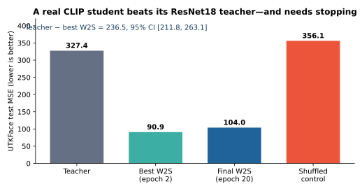
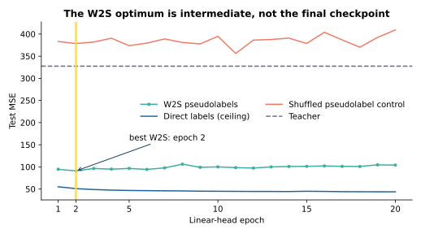
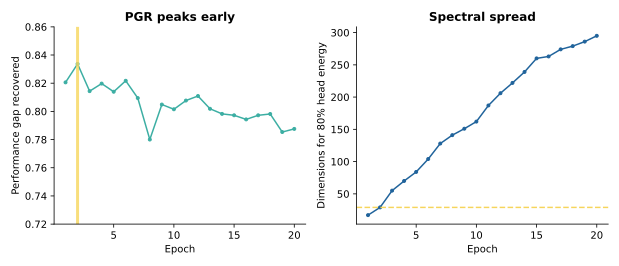
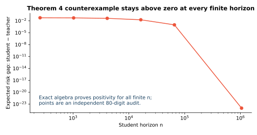
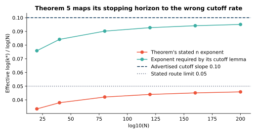

# What makes transfer work? Reproducing—and stress-testing—the spectral account



This paper asks when a student can inherit a strong teacher's knowledge, or
even outperform a weak teacher. Its answer is spectral: distillation expands
the range of learnable directions, while weak-to-strong (W2S) training can
denoise a teacher by stopping before the student's fitted head spreads too
far into noisy directions.

The reproduction preserves the two previously full-credit claims, replaces
two reduced-scale theorem checks with exact counterexamples, and runs the
previously missing real-architecture W2S experiment at the paper's UTKFace
scale. The current repository status is `VERIFIED_SCOPED_WITH_SOURCE_DEFECTS`;
the live judged score remains 6/10 and no score change is claimed.

## The implementation

Every experiment node executes one frozen command:

```bash
uv sync --frozen && uv run python repro/src/run_all.py
```

The cumulative entrypoint validates the committed evidence bundle and invokes
the independent unit checks. The claim runners remain available for reruns;
each writes machine-readable evidence and has an independent checker that
imports no experiment code. Any failed assumption, control, confidence
interval, raw-data recomputation, or claim contract makes the corresponding
command exit nonzero.

The environment is Python 3.12 from `pyproject.toml` and `uv.lock`. Formal
jobs use HF `cpu-upgrade`; no GPU was used.

## Real architectures: the missing evidence

The paper's UTKFace W2S arm freezes a ResNet18 teacher and CLIP ViT-B/32
student. The teacher's ridge head uses exactly 1,000 labels; its predictions
supervise a zero-initialized student linear head on the 20,000-image training
split. The official OpenAI CLIP checkpoint, dataset revision, archives, and
both model checkpoints are hash-pinned. A 2,000-image test split is fixed by
seed `260601295`.

The student reaches MSE 90.92 versus the teacher's 327.44. The paired
teacher-minus-student difference is 236.52, with 95% bootstrap CI
[211.81, 263.15]. A fixed shuffled-pseudolabel control is worse than the
student by 265.22 [245.24, 285.84]. The independent checker recomputes all
four headline MSEs directly from 2,000 raw prediction rows.



The W2S optimum occurs at epoch 2. Continuing to epoch 20 raises MSE to
104.01; the paired increase is 13.08 [10.07, 16.22]. This is a direct test of
the paper's early-stopping mechanism, not merely the observation that some
checkpoint looked attractive.



At the best checkpoint, PGR is 0.834 and 80% of fitted-head energy lies in 29
of 768 PCA directions. Later checkpoints spread across many more directions
while test error rises, matching the qualitative spectral-denoising story.

The paper does not publish its exact split indices, so the seeded split is an
explicit deviation. The first five epochs match its UTKFace protocol; the
20-epoch continuation is a predeclared audit. This route does not claim the
separate, CPU-prohibitive ViT-L/16 fine-tuning arm of Figure 2.

## Theorem 4: an eventual guarantee cannot hold as written

Theorem 4 says that, under its three cited assumptions, there is an `n_0`
after which **every** student horizon strictly beats the teacher. A finite
sweep cannot verify that universal statement, so the replacement check seeks
an admissible counterexample.

The exact construction is embedded in `D=4096` with Rademacher features
`Phi(x)=xi e_1`, identity model projections, target `e_1`, positive Gaussian
noise, and stable paper-algorithm steps. It satisfies the fourth-moment,
sufficient-expressivity, and exact low-intrinsic-tail assumptions. Fraction
arithmetic shows the student-minus-teacher risk is positive for every finite
`n`, approaching equality only from above.



The independent 80-digit implementation samples horizons through 1,048,576;
the final gap is still positive (`9.63e-25`). Five controls probe the
assumption boundary and a calibrated high-noise instance that destroys the
witness. Verdict: **FALSIFIED as written**. A strictly positive-spectrum or
variance-over-bias condition could support a corrected theorem.

## Theorem 5: two identities expose the rate mismatch

The paper defines
`PGR=(R_T-R_T2S)/(R_T-R_S)` but its proof substitutes
`1-PGR=R_T2S/R_T`. Exact cross-multiplication shows this requires the
unstated condition `R_S*(R_T-R_T2S)=0`. In the explicitly included
self-distillation limit, identical teacher and direct-student procedures give
`R_T-R_S=0` pathwise, so PGR is undefined.

There is also a stopping-rate mismatch. At
`alpha_T=alpha_S=2`, the advertised cutoff grows as `N^(1/10)`, while the
theorem sets the sample horizon to `N^(1/10)`. Its own cutoff lemma says
`k*~(n/log n)^(1/alpha_S)`, so the horizon must instead scale as `N^(1/5)`.



The independent sweep approaches cutoff slopes 0.05 for the stated route and
0.10 for the reconstruction. The corresponding risk and PGR-gap exponents
also differ by a factor of two. Verdict: **FALSIFIED as written**; a corrected
result must define a nonzero PGR denominator and multiply the stopping
exponent by `alpha_S`.

## Claim-by-claim assessment

| Claim | Paper result | Observed evidence | Assessment |
| --- | --- | --- | --- |
| 1 | Three-part T2S decomposition | 9,000-system identity error `9.77e-15`; `0.01978+0+0.00562=0.02541` | VERIFIED_SCOPED |
| 2 | `DER=Omega~(N^kappa)` | 180 exact exponent cases, 40 tails, 28 horizons; finite DER min 1.216 | VERIFIED_SCOPED |
| 3 | Eventual strict W2S | Admissible `D=4096` gap stays positive for every finite `n` | FALSIFIED_AS_WRITTEN |
| 4 | Optimal stopping and PGR rates | Undefined denominator, invalid identity, factor-two cutoff mismatch | FALSIFIED_AS_WRITTEN |
| 5 | Real architectures and early stopping | ResNet18 327.44 vs CLIP W2S 90.92; epoch 2 beats epoch 20 with positive CI | VERIFIED_SCOPED_WITH_PROTOCOL_LIMITS |

The strict paper-wide gate remains `NOT_READY`: exact UTKFace split indices
are unpublished and the separate ViT-L/16 fine-tuning arm was not run. No
score forecast or score change is claimed before a live judge verdict.
